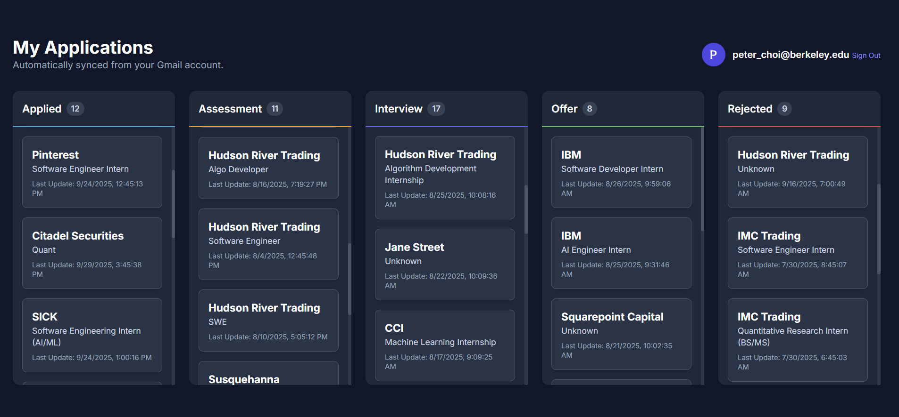

# Internship Application Tracker

A smart web app that automatically tracks and organizes your internship applications directly from Gmail — powered by AI.

---

## Overview

This web application streamlines the internship application process by automatically tracking your applications from your Gmail account.  
It intelligently parses your emails to identify **application statuses**, **company names**, and **job roles**, then organizes them into a clean, easy-to-use **Kanban board**.

  

---

## Features

- 🔍 **Automatic Tracking** — Securely connects to your Gmail to find and parse application-related emails.  
- 🤖 **AI-Powered Parsing** — Uses the **Google Gemini API** to accurately extract company and role information from varied email subjects.  
- 🗂️ **Kanban Dashboard** — Visualizes your pipeline with columns for “Applied,” “Assessment,” “Interview,” “Offer,” and “Rejected.”  
- 🔁 **Latest Status Updates** — Consolidates multiple emails for the same role to show only the most recent status.  
- 🧠 **Smart Filtering** — Filters out irrelevant emails (like university notifications) for a cleaner board.  
- 🔐 **Secure Authentication** — Uses **Google Identity Services (OAuth 2.0)** for safe, read-only access to emails.

---

## Technologies Used

**Frontend:**  
- HTML5  
- CSS3  
- Vanilla JavaScript  

**APIs:**  
- Google Gmail API  
- Google Gemini API  
- Google Identity Services (OAuth 2.0)  

**Icons:**  
- [Lucide Icons](https://lucide.dev)

---

## ⚙️ How It Works

The app follows a **three-step process** to build your dashboard:

1. **Gmail API Scan**  
   - Queries the Gmail API for recent emails (last 6 months) with keywords like `"application"`, `"interview"`, or `"offer"`.  
   - Filters out irrelevant terms.

2. **Gemini API Extraction**  
   - Sends email subjects in batches to the **Gemini API**, which extracts the **company name** and **role title** as structured JSON.

3. **Frontend Rendering**  
   - Combines extracted data with local keyword analysis of the email content.  
   - Determines each application’s **current status** and renders the **Kanban board** dynamically.
